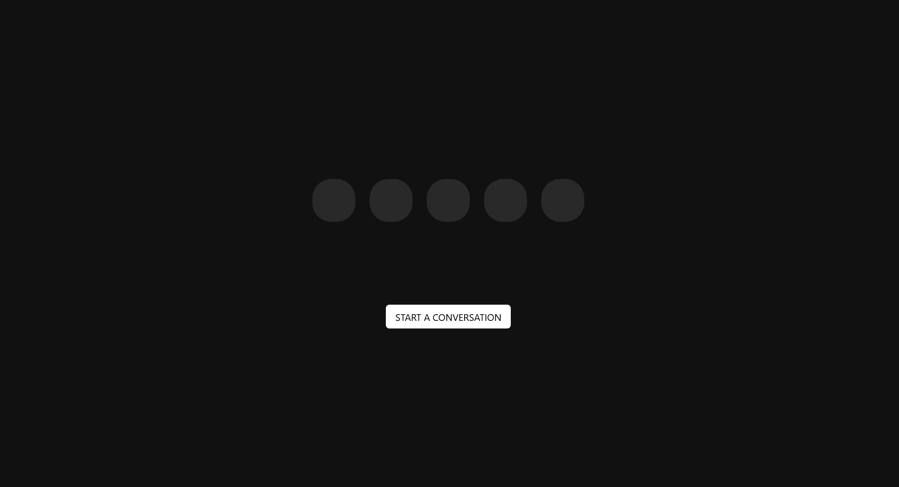

# FRONTEND


# Web Voice Assistant

The Voice Assistant is an intelligent, web-based assistant that combines real-time voice interaction with smart home control capabilities and internet search functionality. It's a platform where conversational AI meets practical utility—enabling users to get information from the web, control home temperatures, and check weather conditions through natural voice commands. The Voice Assistant simplifies everyday tasks by providing a hands-free interface to digital information and smart home control, all within a seamless web-based system.

This is a starter template for [LiveKit Agents](https://docs.livekit.io/agents/overview/) that provides a simple voice interface using the [LiveKit JavaScript SDK](https://github.com/livekit/client-sdk-js).

This template is built with Next.js and is free for you to use or modify as you see fit.



## Getting started

> [!TIP]
> If you'd like to try this application without modification, you can deploy an instance in just a few clicks with [LiveKit Cloud Sandbox](https://cloud.livekit.io/projects/p_/sandbox/templates/voice-assistant-frontend).

Run the following command to automatically clone this template.

```bash
lk app create --template voice-assistant-frontend
```

Then run the app with:

```bash
npm install
npm run dev
```

And open http://localhost:3000 in your browser.

You'll also need an agent to speak with. Try our sample voice assistant agent for [Python](https://github.com/livekit-examples/voice-pipeline-agent-python), [Node.js](https://github.com/livekit-examples/voice-pipeline-agent-node), or [create your own from scratch](https://docs.livekit.io/agents/quickstart/).

> [!NOTE]
> If you need to modify the LiveKit project credentials used, you can edit `.env.local` (copy from `.env.example` if you don't have one) to suit your needs.

## Contributing

This template is open source and we welcome contributions! Please open a PR or issue through GitHub, and don't forget to join us in the [LiveKit Community Slack](https://livekit.io/join-slack)!

# BACKEND

<a href="https://livekit.io/">
  
</a>

# Node.js Multimodal Voice Agent

<p>
  <a href="https://cloud.livekit.io/projects/p_/sandbox"><strong>Deploy a sandbox app</strong></a>
  •
  <a href="https://docs.livekit.io/agents/overview/">LiveKit Agents Docs</a>
  •
  <a href="https://livekit.io/cloud">LiveKit Cloud</a>
  •
  <a href="https://blog.livekit.io/">Blog</a>
</p>

A basic example of a multimodal voice agent using LiveKit and the Node.js [Agents Framework](https://github.com/livekit/agents-js).

## Dev Setup

Clone the repository and install dependencies:

```bash
npm install
```

Set up the environment by copying `.env.example` to `.env.local` and filling in the required values:

- `LIVEKIT_URL`
- `LIVEKIT_API_KEY`
- `LIVEKIT_API_SECRET`
- `OPENAI_API_KEY`

You can also do this automatically using the LiveKit CLI:

```bash
lk app env
```

To run the agent, first build the TypeScript project, then execute the output with the `dev` or `start` commands:

```bash
npm run build
node dist/agent.js dev # see agents-js for more info on subcommands
```
